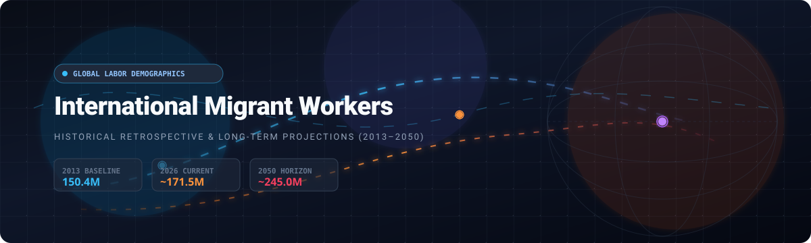
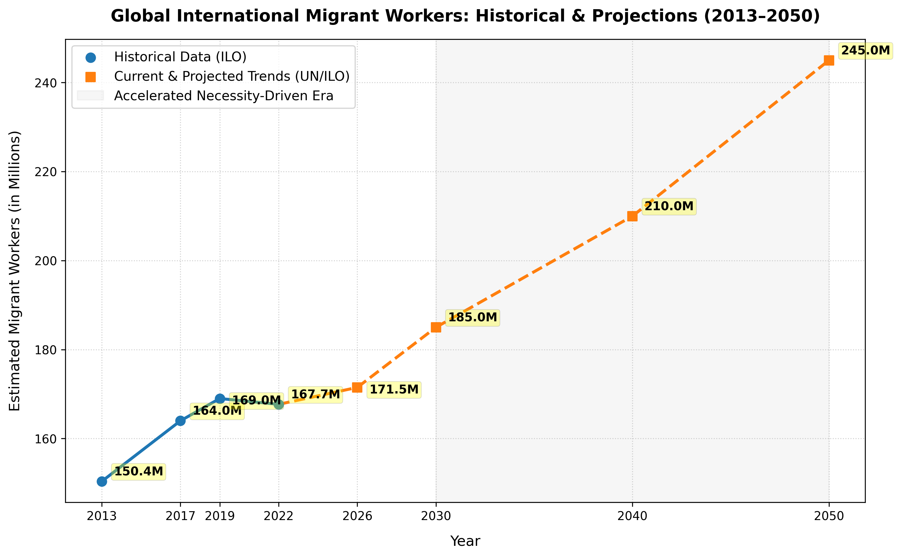
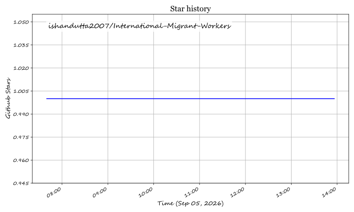

  

# 🌐 International-Migrant-Workers

  
  
  
  
  
  

## 📊 Global International Migrant Workers: Historical & Projected Trends

| Year | 📈 Estimated Migrant Workers | 🌍 % of Global Labor Force | 🔍 Primary Conceptual Change / Catalyst |
|---|---|---|---|
| 2013 (Hist.) 🗓️ | 150.4 Million | 4.4% | 🏭 Baseline modern reporting year; early expansion of interconnected manufacturing lines. |
| 2017 (Hist.) 🗓️ | 164.0 Million | 4.7% | 🏗️ Rapid growth heavily driven by Gulf infrastructure projects and Western European labor demands. |
| 2019 (Hist.) 🗓️ | 169.0 Million | 4.9% | ✈️ Historic pre-pandemic peak of fluid corporate and seasonal mobility. |
| 2022 (Hist.) 🗓️ | 167.7 Million | 4.7% | 📉 Minor technical contraction directly resulting from remaining zero-COVID restrictions and logistics bottlenecks. |
| 2026 (Curr.) ⚡ | ~171.5 Million | ~4.9% | 🛫 Present operational recovery tracking with the normalization of international aviation and relaxed global visa channels. |
| 2030 (Proj.) 🔮 | ~185.0 Million | ~5.1% | 🎯 Target deadline for the UN Sustainable Development Goals (SDGs). Projected growth driven by bilateral "Global Skill Partnerships" designed to feed aging labor markets. |
| 2040 (Proj.) 🔮 | ~210.0 Million | ~5.4% | ⏳ Point where extreme demographic contractions in East Asia (e.g., Japan, South Korea) and Southern Europe make foreign labor structurally non-negotiable to prevent GDP stagnation. |
| 2050 (Proj.) 🔮 | ~245.0 Million | ~5.8% | 🌊 The Convergence Point. The intersection of demographic youth booms in Sub-Saharan Africa and South Asia, coupled with millions of individuals shifting into cross-border employment following localized climate-induced loss of agriculture or water availability. |

---

## 💡 Key Takeaways from the Data Curve

* 🚀 **The Post-2030 Inflection**: While the historical timeline (2013–2022) shows a steady, linear addition of about 1.7 million workers per year, the forecast timeline (2030–2050) accelerates to an average of 3 million additions per year.
* 🔄 **The Structural Shift**: This steeper trajectory reflects a systemic shift from opportunity-driven labor mobility to necessity-driven migration, forced by the rapid aging of major consumer economies and environmental pressures affecting traditional domestic sectors like agriculture.

---

## ⭐ Star History

## Star History

<a href="https://star-history.com/#ishandutta2007/International-Migrant-Workers&Timeline" align="center">
  <picture>
    <source media="(prefers-color-scheme: dark)" srcset="assets/ishandutta2007_International-Migrant-Workers_growth.svg">
    
  </picture>
</a>
